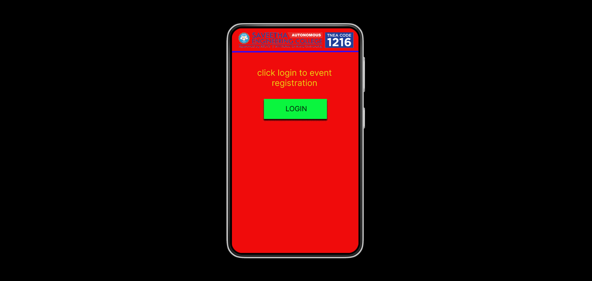
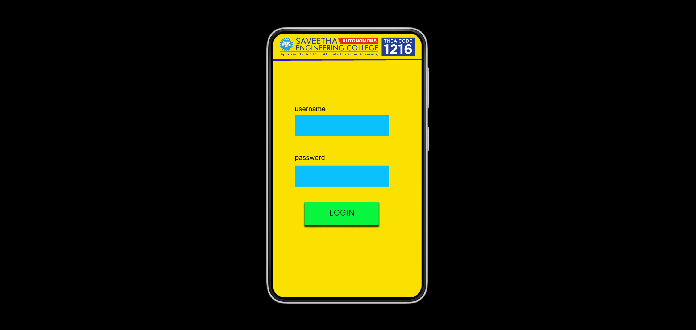
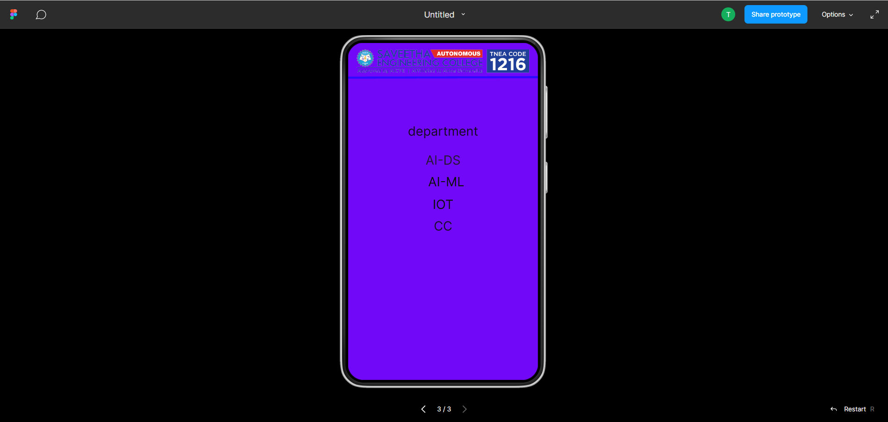

# Event Registration Web Application

## AIM:
To design, develop and deploy a web application for event registration.

## DESIGN STEPS:

### Step 1:
create a new frame.

### Step 2:
select any one present size of your choice.

### Step 3:
select the shapes you need.

### Step 4:
import images as needed.

### Step 5:
create pages based on your need and link them.

### Step 6:

Validate the HTML and CSS code.

### Step 6:

Publish the website in the given URL.

## DESIGN Tool:
figma

## code:
/* username */

position: absolute;
width: 160px;
height: 28px;
left: 53px;
top: 173px;
font-family: 'Inter';
font-style: normal;
font-weight: 400;
font-size: 16px;
line-height: 19px;
color: #000000;

/* logo 1 */

position: absolute;
width: 338px;
height: 46px;
left: 13px;
top: 11px;
background: url(logo.png);

/* Line 1 */

position: absolute;
width: 360px;
height: 0px;
left: 0px;
top: 69px;
border: 4px solid #2C0AFF;
transform: rotate(-0.16deg);

/* click login to event registration */

position: absolute;
width: 274px;
height: 56px;
left: 41px;
top: 112px;
font-family: 'Inter';
font-style: normal;
font-weight: 400;
font-size: 24px;
line-height: 29px;
text-align: center;
color: #EBD513;

/* Rectangle 1 */

position: absolute;
width: 179px;
height: 57px;
left: 91px;
top: 201px;
background: #0AF53E;
box-shadow: 0px 4px 4px rgba(0, 0, 0, 0.25), 0px 4px 4px rgba(0, 0, 0, 0.25), 0px 4px 4px rgba(0, 0, 0, 0.25), 0px 4px 4px rgba(0, 0, 0, 0.25), 0px 4px 4px rgba(0, 0, 0, 0.25), 0px 4px 4px rgba(0, 0, 0, 0.25);

/* LOGIN */

position: absolute;
width: 152px;
height: 28px;
left: 107px;
top: 217px;
font-family: 'Inter';
font-style: normal;
font-weight: 400;
font-size: 20px;
line-height: 24px;
text-align: center;
color: rgba(0, 0, 0, 0.9);

/* login page */

position: relative;
width: 360px;
height: 640px;
background: #FAE102;

* logo 2 */

position: absolute;
width: 338px;
height: 46px;
left: 11px;
top: 9px;
background: url(logo.png);

/* Line 2 */

position: absolute;
width: 360px;
height: 0px;
left: 0px;
top: 66.03px;
border: 4px solid #2C0AFF;
transform: rotate(-0.16deg);

/* Rectangle 2 */

position: absolute;
width: 227px;
height: 51px;
left: 53px;
top: 197px;
background: #0AC1FB;

/* Rectangle 3 */

position: absolute;
width: 227px;
height: 51px;
left: 53px;
top: 197px;
background: #0AC1FB;

/* Rectangle 4 */

position: absolute;
width: 227px;
height: 51px;
left: 53px;
top: 320px;
background: #0AC1FB;

/* username */

position: absolute;
width: 160px;
height: 28px;
left: 53px;
top: 173px;
font-family: 'Inter';
font-style: normal;
font-weight: 400;
font-size: 16px;
line-height: 19px;
color: #000000;

/* password */

position: absolute;
width: 139px;
height: 18px;
left: 53px;
top: 291px;
font-family: 'Inter';
font-style: normal;
font-weight: 400;
font-size: 16px;
line-height: 19px;
color: #000000;

/* SEC page */

position: relative;
width: 360px;
height: 640px;
background: #7208F8;

/* logo 3 */

position: absolute;
width: 338px;
height: 46px;
left: 11px;
top: 12px;
background: url(logo.png);

/* Line 3 */

position: absolute;
width: 360px;
height: 0px;
left: 0px;
top: 68.03px;
border: 4px solid #2C0AFF;
transform: rotate(-0.16deg);

/* department */

position: absolute;
width: 210px;
height: 46px;
left: 75px;
top: 153px;
font-family: 'Inter';
font-style: normal;
font-weight: 400;
font-size: 24px;
line-height: 29px;
text-align: center;
color: rgba(11, 10, 10, 0.9);

/* AI-DS */

position: absolute;
width: 130px;
height: 32px;
left: 115px;
top: 208px;
font-family: 'Inter';
font-style: normal;
font-weight: 400;
font-size: 24px;
line-height: 29px;
text-align: center;
color: rgba(28, 26, 26, 0.9);

/* AI-ML */

position: absolute;
width: 118px;
height: 34px;
left: 127px;
top: 249px;
font-family: 'Inter';
font-style: normal;
font-weight: 400;
font-size: 24px;
line-height: 29px;
text-align: center;
color: #0E0E0E;

/* IOT */

position: absolute;
width: 68px;
height: 44px;
left: 146px;
top: 292px;
font-family: 'Inter';
font-style: normal;
font-weight: 400;
font-size: 24px;
line-height: 29px;
text-align: center;
color: #0F0E0E;

/* CC */
position: absolute;
width: 78px;
height: 35px;
left: 141px;
top: 333px;
font-family: 'Inter';
font-style: normal;
font-weight: 400;
font-size: 24px;
line-height: 29px;
text-align: center;
color: rgba(15, 14, 14, 0.9);

## OUTPUT:

## Result:
the program to design, develop and deploy a web application for event registration is completed successfully.

